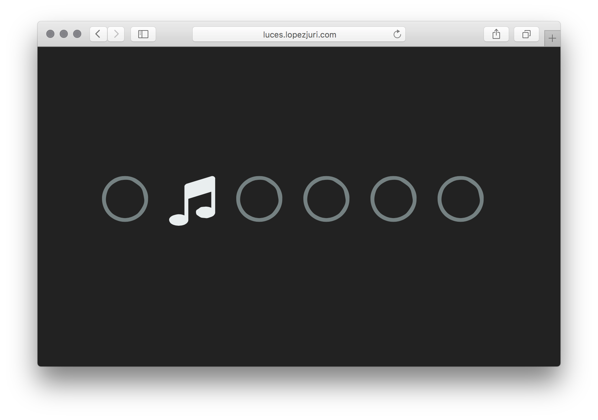

# Luces React



## Development

Clone this repository:

```sh
git clone https://github.com/mrpatiwi/luces-react.git
```

### Setup

```sh
npm install
```

### Running

Start the development server on [`http://localhost:5000`](http://localhost:5000/) with:

```sh
npm start
```
